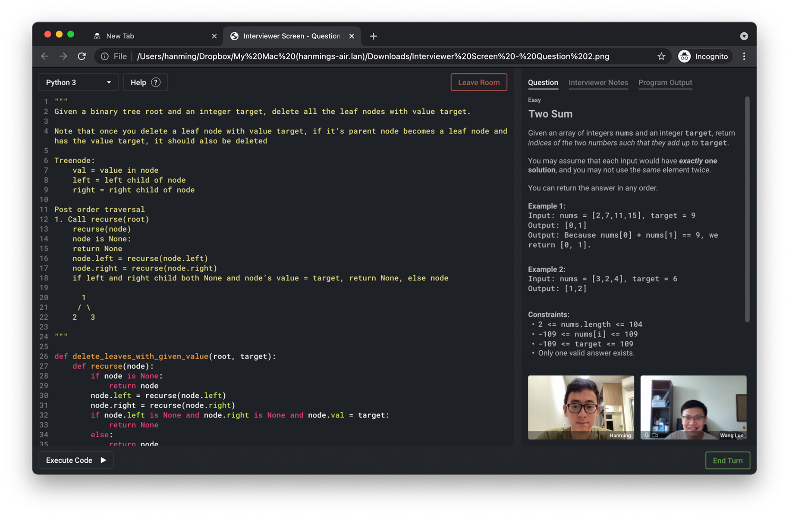

<!-- markdownlint-disable MD033 MD041 -->
<p align="center"></p>

<h1 align="center">Doodle2Gather</h1>

<p align="center">&nbsp;&nbsp;&nbsp;</p>

## Overview

Code2Gather is designed to help programmers to secure internships and jobs by facilitating mock interviews. It allows you to focus on practicing, instead of spending time finding people to practice with.

On our platform, you can simply select a question difficulty that you wish to attempt, and we will match you with a suitable mock interview partner! No need to worry about the questions or channels for feedback - Code2Gather will settle everything for you.

## Team Members

Members of CS3219 Team 32:

- [He XinYue](https://github.com/eksinyue)
- [Wang Luo](https://github.com/Asthenosphere)
- [Wen Junhua](https://github.com/Jh123x)
- [Zhu Hanming](https://github.com/zhuhanming)

## Demo Video

<p align="center"><a href="https://youtu.be/GQCbt3Bls4Y"></img></a></p>

## Project Requirements

This project requires Docker and Docker Compose to be installed. We will be using the `docker-compose` family of commands.

We will also have some local dependencies to help with developer UX. This will require the following:

### Node.js v14 LTS

One easy way to install Node is to simply download from [their website](https://nodejs.org/en/).

Another alternative way is to utilise [`nodenv`](https://github.com/nodenv/nodenv). Do check out their `README.md` for OS-specific installation instructions.

### Yarn

Once you have Node installed, simply install Yarn using `npm`:

```sh
npm install --global yarn
```

We will be using Yarn for Node dependency management, as well as for its workspaces functionality, the latter of which will streamline some project-level processes, such as pre-commit checks.

### Python 3.9

Similar to Node, use [`pyenv`](https://github.com/pyenv/pyenv) to make your life easier.

```bash
curl https://pyenv.run | bash
pyenv install 3.9.4 # >= 3.9
pyenv local 3.9.4
```

### Poetry

Install [Poetry](https://python-poetry.org), version 1.1.9.

```bash
curl -sSL https://raw.githubusercontent.com/python-poetry/poetry/master/install-poetry.py | env POETRY_VERSION=1.1.9 python -
```

Or if you already have Poetry installed, simply run:

```sh
poetry self update
```

Poetry is our choice of dependency manager for our Python packages.

### Go

You can install Go from their [website](https://golang.org/doc/install).

## Contributing to Code2Gather

### Installation

First, clone this repository:

```sh
git clone https://github.com/CodeToGather/Code2Gather.git
```

Then, navigate to the **project root** and install the dependencies:

```sh
cd Code2Gather
yarn install-all
# Or if your machine cannot cope with the installations being run parallel,
# you can run `yarn install-all-ci` instead, which does things sequentially
```

> Please do not navigate to the packages/services individually! This single `yarn install-all` will do the trick.

### Set-up `docker-compose.yml` file

Make a copy of the `docker-compose.yml` file:

```sh
cp docker-compose.yml docker-compose.local.yml
```

Fill up the environment variables that are empty in the `docker-compose.local.yml` file.

Then, start developing by running:

```sh
yarn start
```

### Committing

Please read [`CONTRIBUTING.md`](CONTRIBUTING.md) for our commit guidelines.

The easiest way to start committing is to run the following command anywhere within the project directory:

```sh
yarn commit
```

You will be guided through an interactive prompt that will help you craft a beautiful commit message, using `commitizen`.

### Adding a New Package/Service

First, create a new directory and add a `package.json` file there:

```sh
mkdir package
cd package
touch package.json
```

Then copy the following content into the new `package.json`:

```json
{
  "name": "",
  "version": "0.0.1",
  "description": "",
  "private": true
}
```

The above is the bare minimum you must have for the new package. Then, head over to the root `package.json` and add a new `install-all:package` script:

```json
"scripts": {
  "install-all:package": "cd package && yarn install"
}
```

You will then need to check for the following cases:

1. Do you have non-Node installations? For example, you're using Python and Poetry.

   If so, add the relevant installation command under the `postinstall` script for your package's `package.json`:

   ```json
   "scripts": {
     "postinstall": "poetry install"
   }
   ```

   See [`code-executor/package.json`](code-executor/package.json) for an example.

1. Do you have files besides `.js`, `.jsx`, `.ts` or `.tsx` to lint?

   If so, add a lint command under your package's `package.json` and add the following to the root `package.json`:

   ```json
   "scripts": {
     "lint:package": "cd package && lint"
   }
   ```

   You will also need to add the `lint-staged` dev dependency to your package and add the relevant linting to `lint-staged` under your package's `package.json`. An example would be `room`'s `package.json`:

   ```json
   "lint-staged": {
     "**/*.go": [
       "gofmt -w ."
     ]
   }
   ```

   You will then need to head over to the root `package.json` and add a new `pre-commit:package` script:

   ```json
   "scripts": {
     "pre-commit:package": "cd package && yarn lint-staged"
   }
   ```

1. Do you have any set-up required? Such as creating a database.

   If so, add a new `setup:package` script to the root `package.json`.

   ```json
   "scripts": {
     "setup:package": "<insert commands here>"
   }
   ```

   Note that this won't be utilised generally because of Docker Compose. But just to support local development without Docker, this would be ideal to add.
